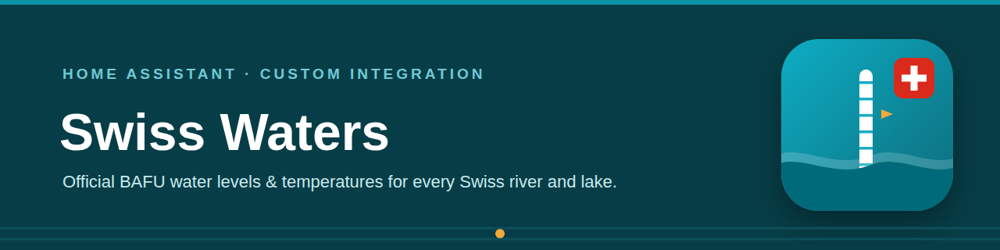

# Swiss Waters (BAFU)

[](https://github.com/hacs/integration)
[](LICENSE)
<a href="https://www.buymeacoffee.com/prusuino"></a>

A Home Assistant custom integration for the official Swiss hydrological monitoring network: live **water temperature**, **water level**, **discharge**, and **flood danger levels** of Swiss rivers and lakes, sourced from the **Federal Office for the Environment (FOEN/BAFU)**.

It also covers the official **bathing sites**: their **bathing water quality** per the EU Bathing Water Directive, and the **live bathing water temperature** of the Zurich lake stations.

Want to know whether the Aare is warm enough for a swim, or keep an eye on the flood danger level of the river next to your house — right on your Home Assistant dashboard? That's what this integration does.

## Background

The FOEN operates around 230 automatic monitoring stations on Swiss rivers and lakes and publishes their raw data — updated **every 10 minutes** — through the Swiss federal [LINDAS linked-data service](https://lindas.admin.ch), its official machine-readable channel. No API key, no registration.

This integration queries LINDAS for all stations within a configurable radius around a location and creates one device per station.

## What it provides

| Entity | Description |
|---|---|
| `sensor.swiss_waters_<station>_temperature` | Water temperature (°C). Only created for stations with a temperature probe (~84 stations). |
| `sensor.swiss_waters_<station>_water_level` | Water level (m a.s.l.). |
| `sensor.swiss_waters_<station>_discharge` | Discharge (m³/s). Rivers only — lakes don't report discharge. |
| `sensor.swiss_waters_<station>_danger_level` | Official flood danger level (1–5), with the localized FOEN danger scale as an attribute. |
| `geo_location.*` | One map marker per station, labeled with the current water temperature on a Map card (see below). |

Each sensor carries the station ID, water body, measurement time, and distance from your configured location as attributes. Data is refreshed every 10 minutes — the same cadence as the source.

### Flood danger levels

| Level | Meaning |
|---|---|
| 1 | No or minor danger |
| 2 | Moderate danger |
| 3 | Considerable danger |
| 4 | High danger |
| 5 | Very high danger |

## Bathing sites

Two additional setup modes cover the ~215 official Swiss bathing sites — again either as a radius overview or as a single favourite:

| Entity | Description |
|---|---|
| `sensor` **Bathing water quality (seasonal assessment)** | Quality class `excellent` / `good` / `sufficient` / `poor` per the EU Bathing Water Directive, computed from the cantonal E. coli and intestinal enterococci samples of the four-season assessment period. Attributes: localised class label, the values of the most recent sample, sample count, canton, distance |
| `sensor` **Last sampling** | Date of the most recent sample behind that assessment |
| `sensor` **Bathing water temperature** | Live water temperature of the Zurich lake stations Tiefenbrunnen and Mythenquai, updated every 30 minutes |

**The quality class is not a live reading.** The cantons sample during the season and report to the FOEN afterwards, so the published assessment always lags the running season. The integration makes that explicit: the entity name says "seasonal assessment", the attributes carry a plain-text note and `live: false`, and the separate "Last sampling" sensor shows exactly how old the assessment is. Only the lake temperatures are live.

The [dashboard strategy](#dashboard) gives every site a section of its own; a tile card per site works just as well if you build your own dashboard — see [Building it yourself](#building-it-yourself) for an example.

## Language

Entity names, device info, and the config flow adapt automatically to your Home Assistant language setting — German, English, French, and Italian are supported, with English as the fallback.

## Installation

### HACS (recommended)

1. In HACS, go to **Integrations → ⋮ → Custom repositories**, add this repository URL with category **Integration**.
2. Search for **"Swiss Waters"** and install.
3. Restart Home Assistant.

### Manual

1. Copy the `custom_components/swiss_waters` folder into your Home Assistant `config/custom_components/` directory.
2. Restart Home Assistant.

## Setup

1. Go to **Settings → Devices & Services → Add Integration**.
2. Search for **"Swiss Waters (BAFU)"** and choose a mode:
   - **Radius overview:** all stations within a radius around a location (latitude/longitude default to your Home Assistant home location).
   - **Favorite a single station:** pick one station by name from the searchable dropdown (e.g. "Aare – Bern, Schönau") — independent of any location, useful for your favorite swimming river.
3. Done. Add the integration again for further favorites or another radius — every entry is independent, and both modes combine freely.

## Dashboard

The integration ships a **dashboard strategy**: a recipe Home Assistant renders in the browser, rather than a dashboard written into your configuration. Nothing is stored, nothing is overwritten, and the result follows your setup — add a station or a bathing site and it appears on the next page load; delete an entry and it is gone, with no leftover card.

### Adding the strategy as a resource

The integration serves the strategy file, but registering it as a Lovelace resource is left to you — the resource list is part of your dashboard configuration, and an integration has no business writing into it. It is a one-time step:

**Settings → Dashboards → ⋮ (top right) → Resources → + Add resource**

| Field | Value |
|---|---|
| URL | `/swiss_waters_files/swiss-waters-dashboard.js` |
| Resource type | JavaScript module |

Then reload the page (Ctrl/Cmd+Shift+R). The *Resources* entry is only shown when **Advanced mode** is enabled in your user profile (click your name at the bottom of the sidebar).

### Creating the dashboard

1. **Settings → Dashboards → + Add dashboard → New dashboard from scratch**, give it a name.
2. Open it, then **✏️ (edit) → ⋮ → Raw configuration editor**.
3. Replace the entire content with:

```yaml
strategy:
  type: custom:swiss-waters
views: []
```

4. Save.

You get:

- a **Map** view — every monitoring station on a full-screen map, each marker labeled with its current water temperature (only shown when station markers exist; a setup with bathing sites alone has none);
- a **Stations** view — one section per monitoring station with its water temperature, water level, discharge and flood danger level as tiles (only the measures the station reports);
- a **Bathing sites** view — one section per bathing site with its quality class and the date of the last sampling, or the live water temperature for the Lake Zurich stations.

View titles follow your Home Assistant language (German, English, French, Italian).

The strategy also appears under **+ Add dashboard** as *Swiss Waters*, which does the same thing without the raw editor.

Everything the strategy produces is a normal Home Assistant dashboard. If you would rather arrange things yourself, build your own dashboard with the entities above — see [Building it yourself](#building-it-yourself). The strategy is an offer, not a requirement.

### Adjusting the strategy

A strategy dashboard has no card editor — the layout is generated fresh on every load. You still have two ways to shape it without giving that up:

**Options.** Anything you add under `strategy:` is passed to the recipe:

```yaml
strategy:
  type: custom:swiss-waters
  title: My title
  max_columns: 3
views: []
```

| Option | Effect |
|---|---|
| `title` | dashboard title |
| `max_columns` | column count of the generated section views |
| `map: false` | leave out the full-screen map view |

**One view inside your own dashboard.** Instead of a separate dashboard, let the strategy fill a single view of one you already have. Open your dashboard's raw configuration editor and add a view:

```yaml
views:
  - title: Home
    # ... your own cards ...
  - title: Swiss Waters
    strategy:
      type: custom:swiss-waters
```

That view is regenerated like the full dashboard is, so new config entries still appear by themselves, while every other view stays yours to edit. The same options work here too.

> **Take control** (⋮ menu) turns a strategy dashboard into a static one you can edit card by card — but it is one-way: the dashboard stops following your config entries from then on. Prefer the two approaches above.

### Building it yourself

Every monitoring station becomes a `geo_location` entity, so Home Assistant's **built-in Map card** can display them — no custom card and no extra HACS dependency required. The card can label each marker with the station's current water temperature out of the box, via its `label_mode: attribute` option.

To set this up:

1. Open the dashboard you want to use (or create a new one under **Settings → Dashboards → Add dashboard**).
2. Choose **Edit dashboard → Add card → Manual**.
3. Paste the following configuration:

```yaml
type: map
geo_location_sources:
  - source: swiss_waters
    label_mode: attribute
    attribute: temperature
default_zoom: 9
```

Bathing sites have no map marker; two **Tile cards** per site show the quality class and the sampling date at a glance. The entity IDs follow the pattern `sensor.swiss_waters_bathing_<site>_quality` / `_last_sample` / `_temperature` — copy the exact IDs from the entity list of the site's device (Settings → Devices & services → Swiss Waters):

```yaml
type: tile
entity: sensor.swiss_waters_bathing_<site>_quality
name: <Site name> – quality
```

```yaml
type: tile
entity: sensor.swiss_waters_bathing_<site>_last_sample
name: <Site name> – last sample
```

The Lake Zurich temperature stations provide only `sensor.swiss_waters_bathing_<site>_temperature` (no quality class or sampling date).

The integration never creates or modifies a dashboard on your behalf — the strategy above is rendered by your browser and stores nothing, and your dashboards stay entirely under your own control.

> **Note:** the station entities are hidden by default so they don't flood Home Assistant's auto-generated overview map. This only affects entities the first time they are registered; the Map card — in the strategy as well as in the snippet above — finds them regardless, because it selects them by source.

## Notes

- Stations that newly fall within your radius (the network changes rarely) are picked up after a reload or restart of the integration.
- Not every station reports every measure: lake stations have no discharge, and only about a third of the network has temperature probes. Sensors are only created for measures a station actually reports.
- If LINDAS is unreachable, entities become unavailable rather than showing stale data.
- This integration is unofficial and not affiliated with, endorsed by, or supported by the FOEN. It only reads their published data via the official LINDAS service.

## Data source & license

This integration reads live data from the FOEN's hydrological monitoring network via the Swiss federal LINDAS linked-data service. The FOEN requires that the data source is always credited — every entity sets Home Assistant's `attribution` attribute accordingly ("Data: Swiss Federal Office for the Environment FOEN (BAFU)").

Bathing water quality comes from the FOEN's "Qualität der Badegewässer" cube on the same LINDAS service. The bathing water temperatures of the stations Tiefenbrunnen and Mythenquai are published by the **City of Zurich** (water police) as open data under **CC0**, retrieved through the API listed in that dataset; those entities credit both sources.

## Disclaimer

This integration is provided **as-is, without any warranty**. Data is retrieved from a third-party published source and may be inaccurate, delayed, incomplete, or unavailable. Do not rely on this integration for safety-critical decisions — for official flood warnings, always consult the authorities (e.g. [www.naturgefahren.ch](https://www.naturgefahren.ch)). The author(s) accept **no responsibility or liability** for any damage, loss, incorrect readings, or other issues arising from using this integration, whether it stops working, behaves unexpectedly, or never worked correctly for your setup in the first place.

## License

Source code: MIT — see [LICENSE](LICENSE).

## Related integrations

More Home Assistant integrations from the same author:

- [Swiss Public Alerts](https://github.com/prusuino/ha_swiss_public_alerts) — official Alertswiss warnings for your location
- [Swiss Earthquakes](https://github.com/prusuino/ha_swiss_earthquakes) — recent earthquakes from the Swiss Seismological Service on a map
- [Swiss Avalanche Bulletin](https://github.com/prusuino/ha_swiss_avalanche_bulletin) — SLF avalanche danger for your region
- [Swiss Electricity Price](https://github.com/prusuino/ha_swiss_electricity_price) — official ElCom electricity tariffs for your municipality
- [Swiss Solar Reference Price](https://github.com/prusuino/ha_swiss_solar_reference_price) — Swiss solar feed-in reference market price
- [Swiss Charging Stations](https://github.com/prusuino/ha_swiss_charging_stations) — real-time availability and prices of public EV charging stations in Switzerland
- [Swiss Public Transport](https://github.com/prusuino/ha_swiss_transport) — departure boards and connections for Swiss public transport
- [Swiss Parking](https://github.com/prusuino/ha_swiss_parking) — real-time parking availability in Swiss cities
- [Austrian Charging Stations](https://github.com/prusuino/ha_austrian_charging_stations) — real-time availability of public EV charging stations in Austria
- [Innoxel Master 3](https://github.com/prusuino/ha_innoxel_master3) — local control for INNOXEL building automation

## Support

If you find this integration useful, you can support its development:

<a href="https://www.buymeacoffee.com/prusuino"></a>
